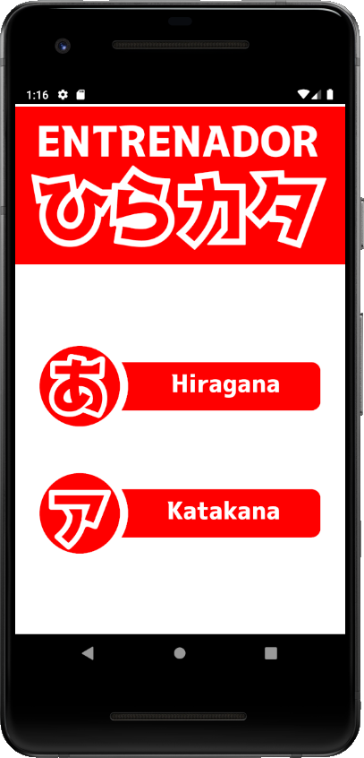
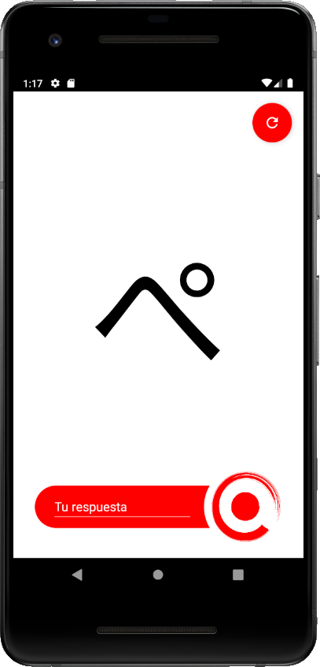
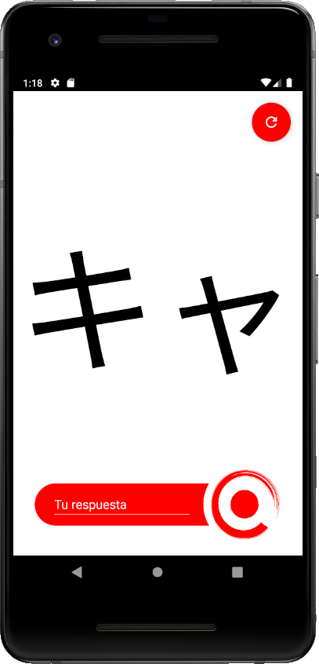
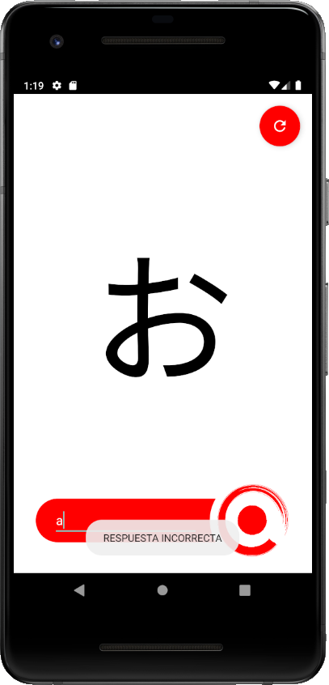
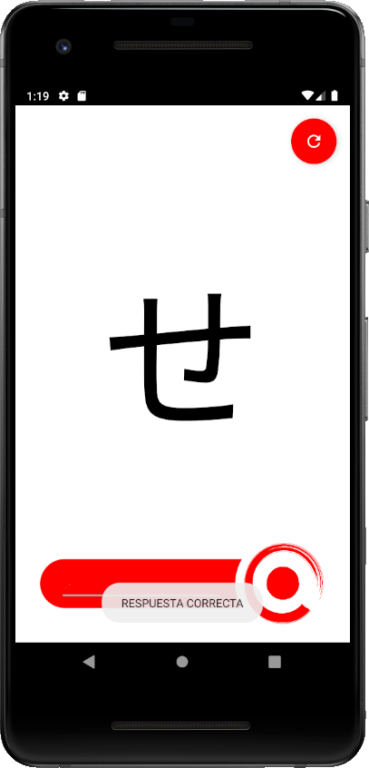

# ENTRENADOR HIRAKATA
Aplicación hecha con fines de estudio. Permite repasar los carácteres del silabario Hiragana y Katakana japonés.
Y no necesita conexión a internet!

## Capturas de pantalla

## Funcionamiento
- La aplicación contiene una lista de todos los caracteres de hiragana y katakana.
- Cada caracter tiene su relacion a escritura occidental.
- Dentro de la pantalla de hiragana o katakana, la aplicación lanza de forma aleatoria los caracteres, a los cuales el usuario debe responder su traducción occidental.
- Si no se recuerda la respuesta, puede pinchar el boton de "refrescar" que lanzará otro caracter aleatorio.

## POR DESARROLLAR
- Estoy trabajando en un contador, para conservar un registro de respuestas correctas.
- Mantener un diseño simple y atractivo.